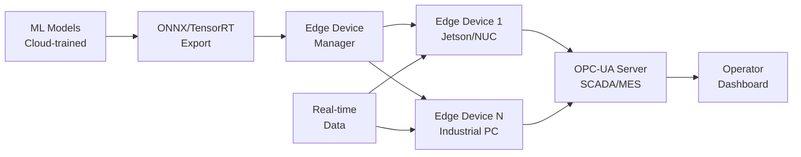

# Edge AI Inference Platform

**Deploy and manage ML models at the manufacturing edge — OPC-UA integration, sub-millisecond inference, fleet management**

## The Problem

Cloud ML inference introduces latency (100-500ms), requires constant connectivity, incurs data egress costs, and creates security risks in air-gapped environments. Edge deployment solves this with <5ms latency, offline capability, and zero cloud dependency.

This platform provides:
- **Multi-hardware support**: NVIDIA Jetson, Intel NUC, Raspberry Pi 5, industrial PCs
- **Sub-5ms inference latency** on defect detection models
- **ONNX/TensorRT optimization** with hardware-specific acceleration
- **OPC-UA integration** exposing inference results to SCADA/MES
- **Fleet management**: 100+ edge devices from single dashboard
- **OTA model updates** with automatic rollback on degradation
- **Network segmentation** for IT/OT security

## Architecture



## Key Capabilities

### 1. Edge Runtime Engine
- ONNX model loading with TensorRT acceleration
- Dynamic batching for throughput optimization
- Model hot-reload without downtime
- Inference queue with priority scheduling
- Latency SLAs enforcement (<5ms for safety-critical)

### 2. OPC-UA Server
- Custom manufacturing node namespace
- Real-time inference result publishing
- Historical data archiving (HA)
- Certificate-based security
- Event-based notifications

### 3. PLC Connector
- Protocols: Modbus TCP/RTU, EtherNet/IP, PROFINET, S7
- Real-time parameter reading and setpoint writing
- Ladder logic integration hooks
- Fail-safe defaults on communication loss

### 4. Fleet Monitor
- Centralized device health dashboard
- 100+ concurrent device management
- Remote configuration and troubleshooting
- OTA update orchestration
- Alert system for device/model degradation

### 5. Model Compression
- INT8 quantization with <0.5% accuracy loss
- Pruning for 50-70% model size reduction
- Knowledge distillation from teacher models
- Latency vs accuracy Pareto optimization

### 6. Security Framework
- Secure boot verification
- Model encryption at rest and in transit
- Network segmentation enforcement
- Device authentication and revocation

## Performance Targets

- **Inference latency**: <5ms for defect detection
- **Model update deployment**: <60 seconds fleet-wide
- **Device availability**: >99.9% uptime
- **Network efficiency**: <50MB/day per edge device

## Installation

```bash
pip install -e .

# On edge device, start runtime:
python -m edge_ai_inference_platform.runtime.edge_runtime \
    --models-dir /path/to/models \
    --opc-ua-endpoint opc.tcp://0.0.0.0:4840
```

## Project Structure

```
edge-ai-inference-platform/
├── src/
│   ├── runtime/
│   │   ├── edge_runtime.py
│   │   └── model_registry.py
│   ├── connectivity/
│   │   ├── opc_ua_server.py
│   │   └── plc_connector.py
│   ├── monitoring/
│   │   └── fleet_monitor.py
│   ├── optimization/
│   │   └── inference_optimizer.py
│   └── security/
│       └── edge_security.py
├── examples/
│   ├── deploy_defect_detector.py
│   └── opcua_inference_server.py
├── tests/
│   └── test_edge_runtime.py
├── docs/
│   └── HARDWARE_GUIDE.md
├── pyproject.toml
├── LICENSE
├── .gitignore
└── CONTRIBUTING.md
```

## License

MIT License - see [LICENSE](LICENSE) for details.
